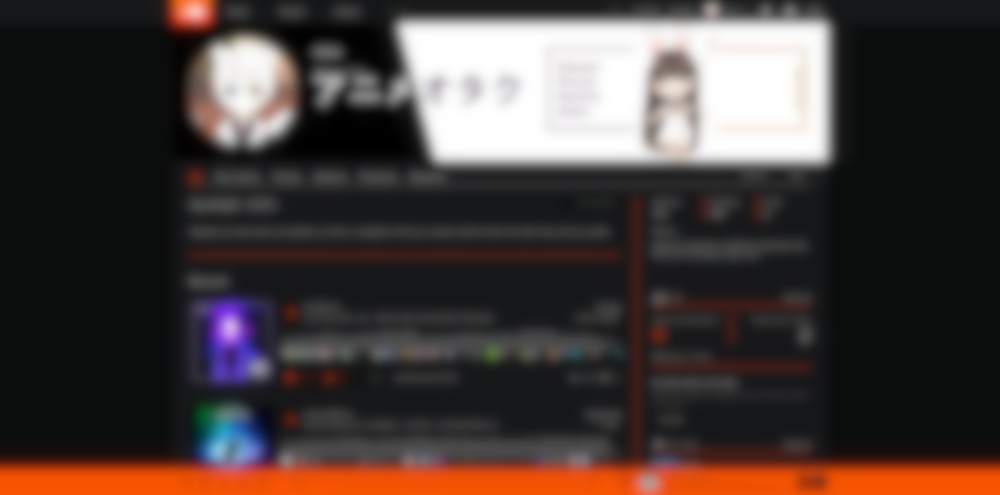

#  **dimcloud** 

### Available for Chromium and Firefox. Work in progress *(but it is slow)*

You might have already heard about some soundcloud extensions which turn soundcloud into something *dark*, but this one is different. This one implements some really famous style (as far as I see).



## Installation

There is no precompiled extension available in any extension store, but will be there later.  However you still can build the extension on your own.

```sh
npm run build
```

It will compile javascript to ES5 and Scss (Sass) to css and also copy manifest files into distribution directory.

## License

See `LICENSE` file.

## Contributing

There are no restrictions yet. If you are experienced with build systems and stuff so you can offer better solution - you're welcome.

